# Ex-01_DS_Data_Cleansing

## AIM
To read the given data and perform data cleaning and save the cleaned data to a file. 

# Explanation
Data cleaning is the process of preparing data for analysis by removing or modifying data that is incorrect ,incompleted , irrelevant , duplicated or improperly formatted. 
Data cleaning is not simply about erasing data ,but rather finding a way to maximize datasets accuracy without necessarily deleting the information. 

# ALGORITHM
### STEP 1
Read the given Data
### STEP 2
Get the information about the data
### STEP 3
Remove the null values from the data
### STEP 4
Save the Clean data to the file

# CODE and OUTPUT
## PROGRAM 1:
```
import numpy as np
import pandas as pd
df=pd.read_csv("/content/Data_set.csv")
print(df.info())
df.head(10)
df.shape
print(df.isnull().sum())
df['aired_on'] = df['show_name'].fillna(df['aired_on'].mode()[0])
print(df.isnull().sum())
df['original_network'] = df['original_network'].fillna(df['original_network'].mode()[0])
df.head(5)
print(df.isnull().sum())
df['watchers'] = df['watchers'].fillna(df['watchers'].median())
df.head(5)
print(df.isnull().sum())
df['rating'] = df['rating'].fillna(df['rating'].mean())
df.head(5)
print(df.isnull().sum())
df = df.dropna(subset=['show_name'])
df.head(5)
print(df.isnull().sum())
df = df.dropna(subset=['current_overall_rank'])
df.head(5)
print(df.isnull().sum())
print(df.info())
```
## PROGRAM 2:
```
import pandas as pd
import numpy as np
df=pd.read_csv("/content/Loan_data.csv")
df.describe()
df.info()
df.isnull().sum()
df = df.dropna(subset="Gender")
df.head(5)
df.isnull().sum()
df = df.dropna(subset=["Dependents"])
df.isnull().sum()
df['Self_Employed'] = df['Self_Employed'].fillna(df['Self_Employed'].mode()[0])
df.head(5)
df.isnull().sum()
df['LoanAmount'] = df['LoanAmount'].fillna(df['LoanAmount'].mean ())
df.head(5)
df.isnull().sum()
df['Loan_Amount_Term'] = df['Loan_Amount_Term'].fillna(df['Loan_Amount_Term'].median())
df.head(5)
df.isnull().sum()
df['Credit_History'] = df['Credit_History'].fillna(df['Credit_History'].mean())
df.head(5)
df.isnull().sum()
```
# OUTPUT

## DATA 1:
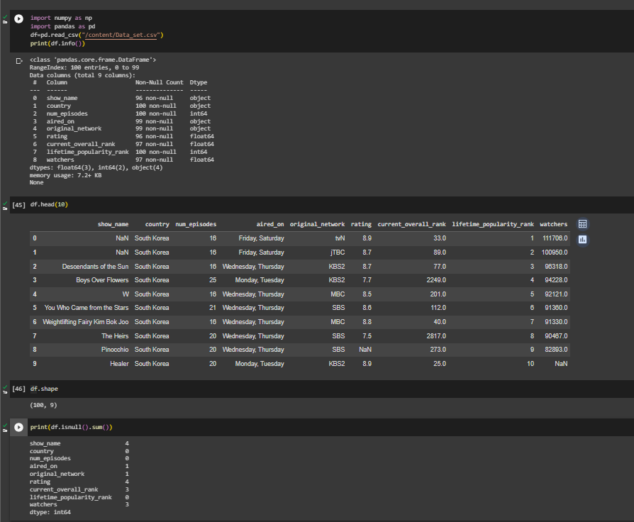<BR>
## NON NULL BEFORE:
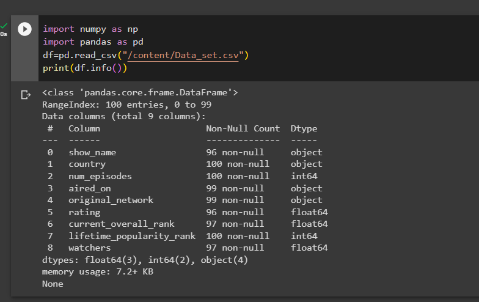<br>
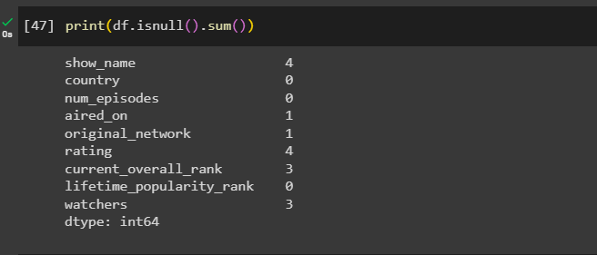<br>
## NON NULL AFTER:
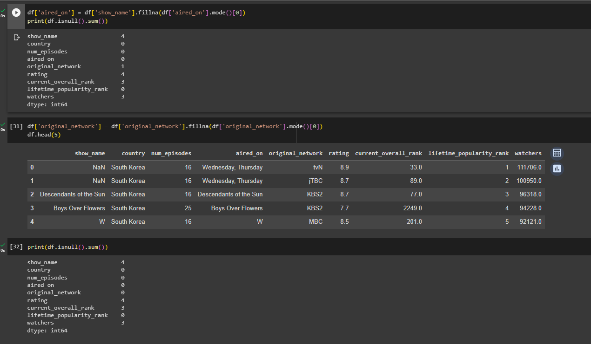<br>
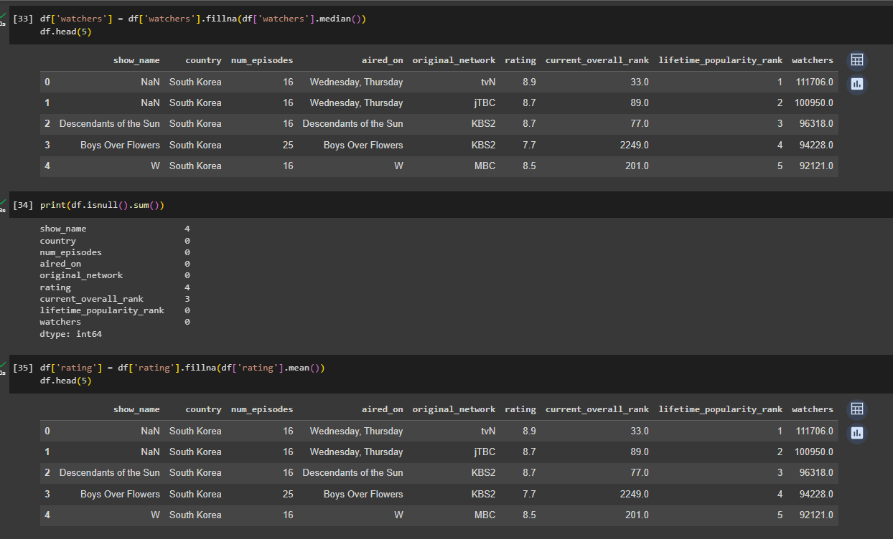<br>
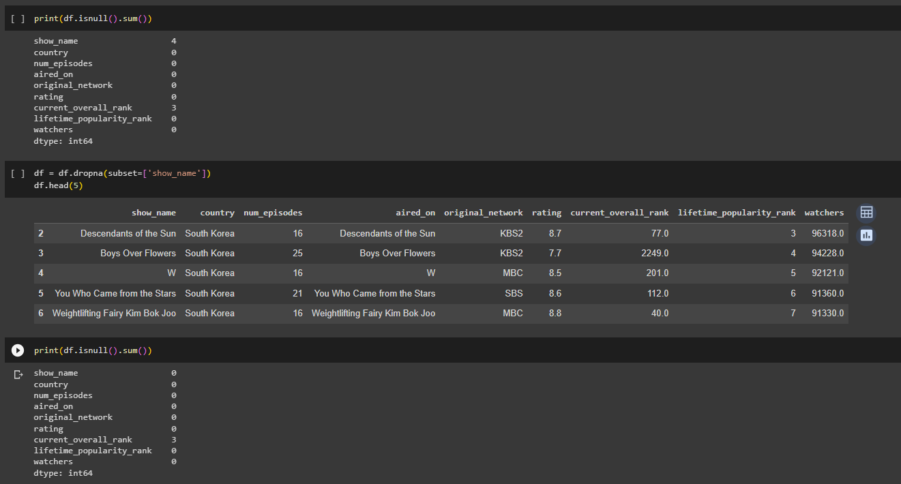<br>
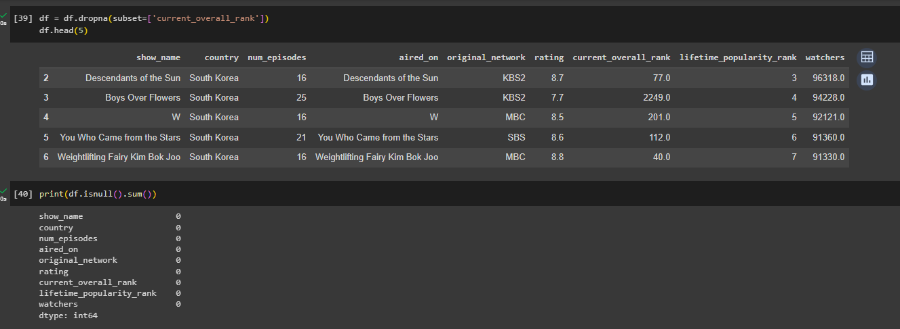<br>
## OUTCOME:
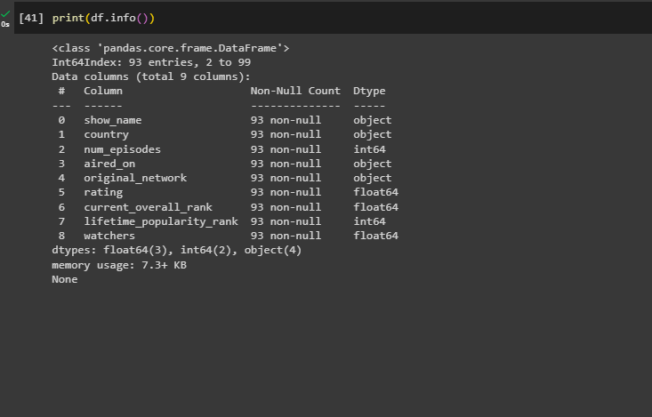<BR>
## DATA 2:
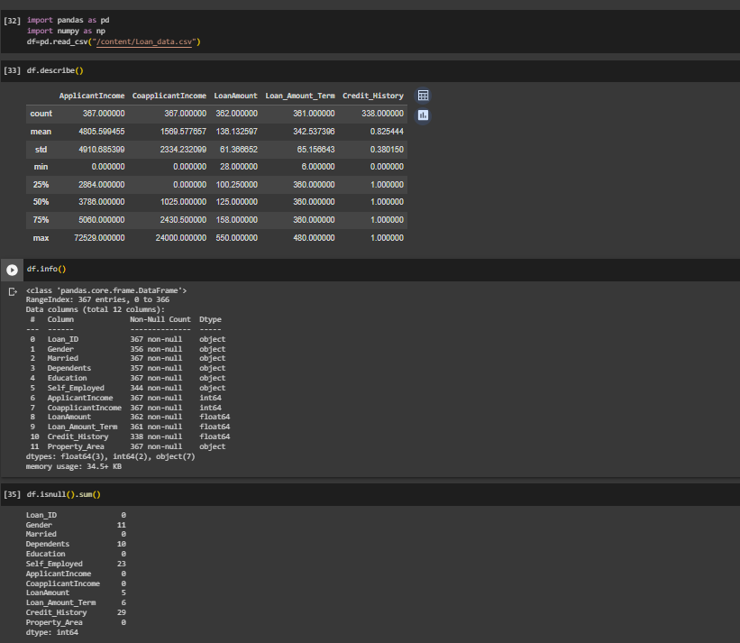<br>
## NON NULL BEFORE:
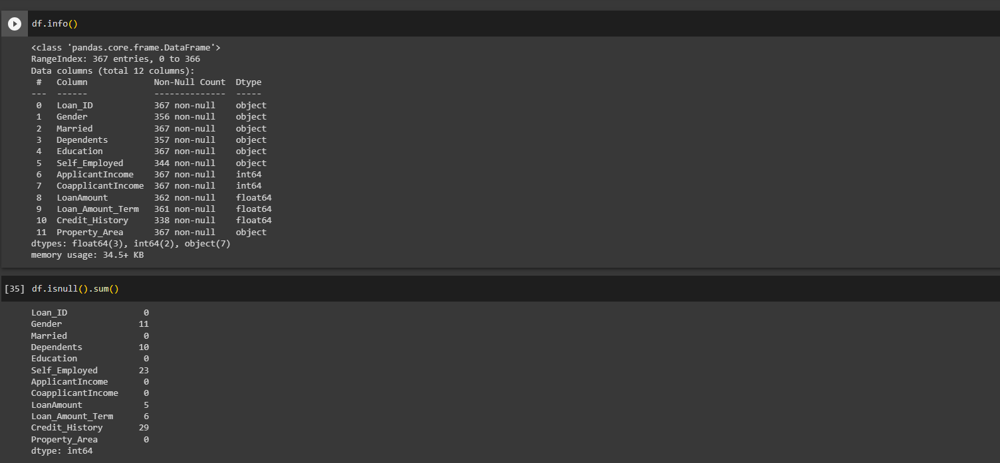<br>
## NON NULL AFTER:
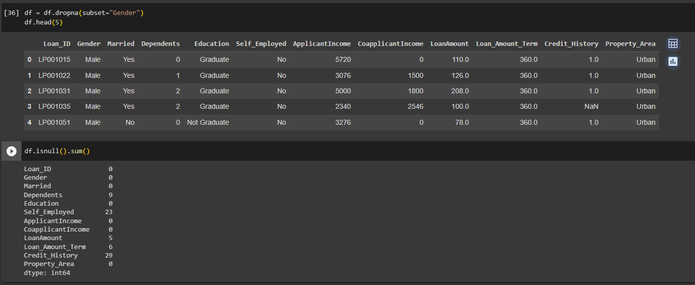<br>
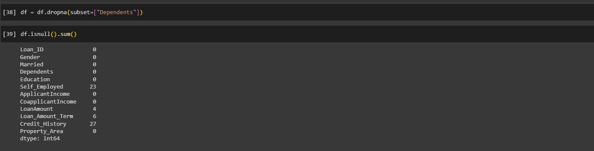<br>
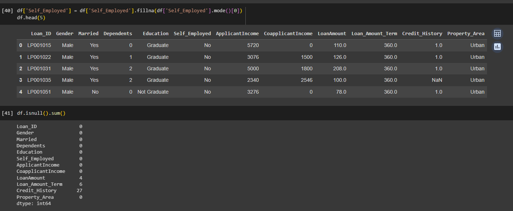<br>
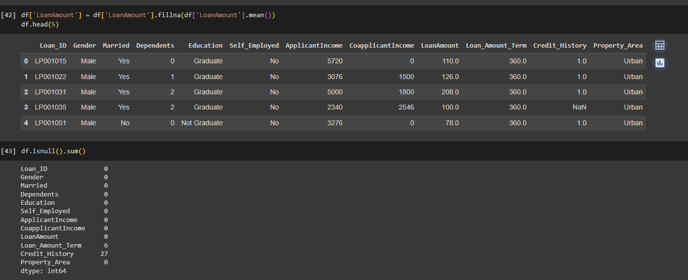<br>
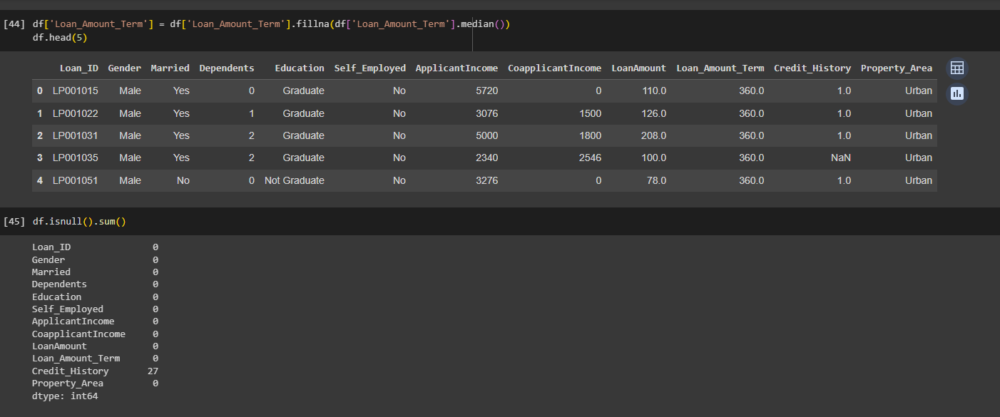<br>
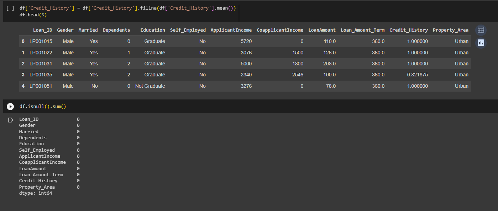<br>
## OUTCOME:
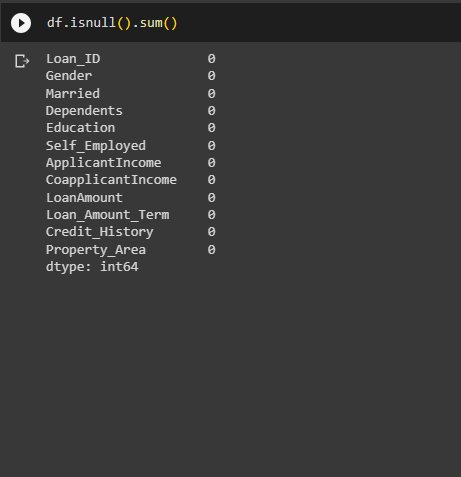
## RESULT:
Thus,the given data is read,cleansed and the cleaned data is saved into the file.
